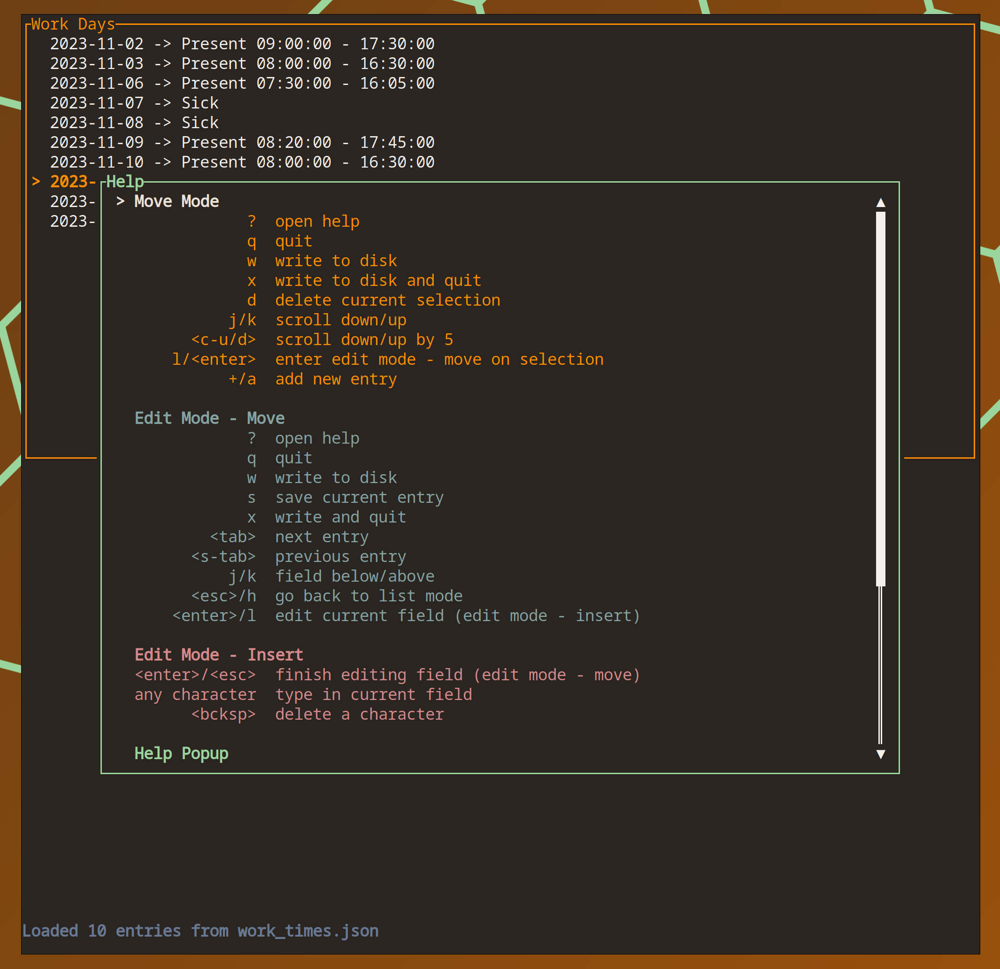
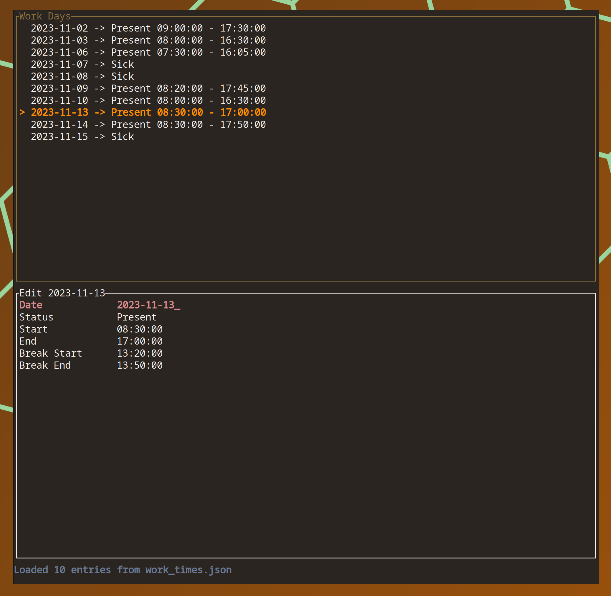
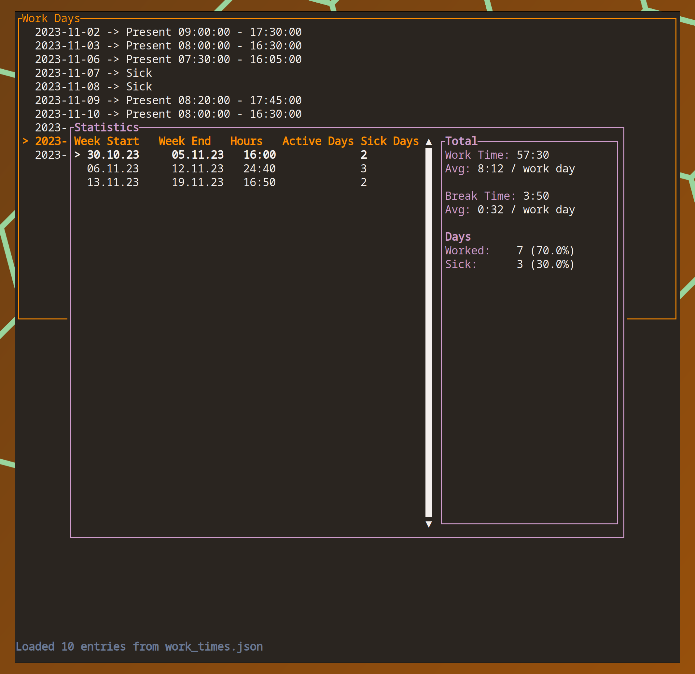

wd - A Minimal Workday Time Tracker with Vim-like Keybindings
---

A terminal workday tracker with vim-like keybindings. Useful for quickly noting down your working times in the terminal. Also includes Features to show statistics of your working times. Stores all of the data in human-readable `JSON`-files.

## Quickstart


Building requires a working (reasonably recent) rust toolchain.

```cmdline
$ git clone https://github.com/Brudihawo/wd.git
$ cd wd
$ cargo install --path . # if you want to install the app
```

Create a new collection
```cmdline
$ wd create [filename.json] # or cargo run -- [filename.json] create 
```

Alternatively, open an existing collection
```cmdline
$ wd open [filename.json] # or cargo run -- [filename.json] open 
```

Once the app is launched, you can view the keybindings using the `?-Key`.

### Help Menu


### Edit Mode


### Statistics Window


## Roadmap

### Mayor / Features
- [x] basic working UI
- [x] basic working editor
- [x] messages from editor to UI
- [x] unofficial day type
- [x] home office day type
- [x] vacation and travel day types
- [x] delete entry
- [x] arg-parsing and default arguments
- [x] write back to file
- [x] statistics
- [ ] weekly / monthly view
- [ ] different databases - just json for now

### Minor / Code Quality
- [ ] better handling of small terminal sizes
- [ ] better encapsulation for editor code
- [x] add help screen when pressing ?
- [x] sort days by date
